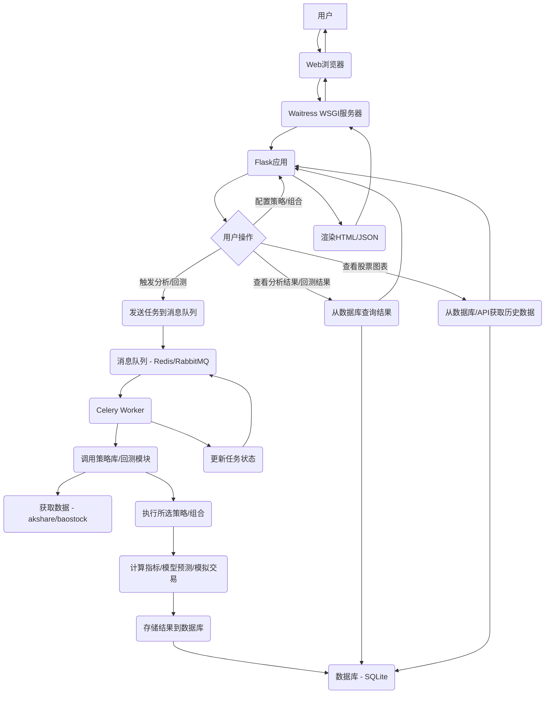
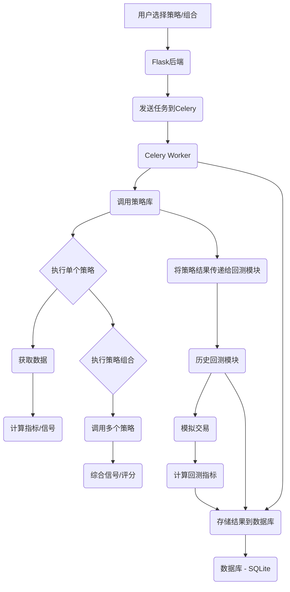

# 量化交易策略系统优化方案计划

## 项目简介

本项目是一个基于Python的量化交易策略系统，通过多维度技术分析和机器学习模型，为A股市场提供选股策略建议。系统具备动态资源管理能力，提供多种分析维度。目前的系统主要通过命令行或脚本运行。

## 优化目标

本次优化的主要目标是：

1.  **构建用户友好的Web端界面：** 使不懂技术的普通用户也能方便地使用系统功能。
2.  **优化预测模型：** 提高选股策略的预测准确性。
3.  **实现历史数据回测功能：** 允许用户评估策略在历史数据上的表现。
4.  **增加图表展示功能：** 直观地展示股票数据和回测结果。
5.  **集成多样的量化选股策略：** 构建策略库，支持策略的选择和组合使用。
6.  **集成 ai-hedge-fund 项目的价值部分：** 吸收其优秀的策略和模块。
7.  **简化部署流程：** 实现通过一个简单的Python命令即可启动Web服务。

## 优化方案架构

为了实现上述目标，我们将构建一个基于Web的量化交易策略分析平台，采用以下技术栈和架构：

*   **Web框架：** Flask (轻量、灵活，适合快速开发)
*   **异步任务处理：** Celery + 消息队列 (Redis/RabbitMQ) (处理耗时分析和回测任务)
*   **数据存储：** **SQLite** 数据库 (简单易用，适合本地部署和小型项目)
*   **WSGI服务器：** **Waitress** (纯Python实现，部署简单)
*   **策略库模块：** 封装和管理多种量化选股策略
*   **历史回测模块：** 实现策略回测逻辑和性能指标计算
*   **图表展示：** 前端JavaScript图表库 (Echarts/Chart.js)

## ai-hedge-fund 项目集成计划

我们将从 `https://github.com/virattt/ai-hedge-fund` 项目中集成以下有价值的部分：

1.  **策略模块：** 提取并适配其技术分析组合、基本面分析、价值投资（模拟巴菲特）等策略逻辑，加入到我们的策略库中。
2.  **回测模块：** 分析并集成其回测框架的核心逻辑，用于实现我们系统的历史数据回测功能。
3.  **风险管理模块 (可选)：** 评估并集成其风险管理逻辑，用于完善回测或未来的实盘模拟。

## 详细实施步骤

1.  **环境准备：** 安装Flask、Celery、Redis、Waitress、数据库驱动、以及前端图表库等依赖。
2.  **项目结构调整：** 重构现有代码，将数据获取、因子计算、模型、策略、回测等功能模块化。
3.  **数据库设计与实现：** 设计并创建数据库表结构，使用 SQLite 存储所需数据。
4.  **Web界面基础搭建：**
    *   搭建Flask应用的基本框架。
    *   设计并实现首页、分析配置页、分析结果页、任务状态页、历史回测配置页、历史回测结果页、个股详情页的HTML模板和基本路由。
5.  **策略库模块开发：**
    *   封装现有分析逻辑为策略模块。
    *   集成 `ai-hedge-fund` 项目中的策略逻辑，适配数据源和接口。
    *   设计策略组合逻辑。
6.  **异步任务集成：**
    *   配置Celery，连接消息队列。
    *   将分析和回测逻辑封装为Celery任务。
    *   在Flask后端调用Celery任务，并实现任务状态查询接口。
7.  **历史回测模块开发：**
    *   实现回测核心逻辑，能够读取历史数据，执行模拟交易。
    *   集成 `ai-hedge-fund` 项目的回测框架核心。
    *   计算夏普比率、最大回撤、总收益等回测性能指标。
8.  **图表功能实现：**
    *   在前端集成Echarts或Chart.js。
    *   开发Flask接口，提供股票历史数据和回测结果数据。
    *   在前端页面使用图表库绘制股票价格/技术指标图和回测资金曲线图。
9.  **预测模型优化：**
    *   对现有LightGBM模型进行超参数调优。
    *   研究并增加更多有效特征。
    *   探索其他机器学习模型。
    *   在回测中评估模型效果。
10. **数据适配与同步：** 确保所有模块都能正确地访问和使用数据。
11. **性能优化：** **在整个开发过程中，持续关注并优化数据处理、计算、回测等各个环节的性能。**
12. **用户认证与授权 (可选)：** 根据需要添加。
13. **错误处理与验证：** 添加必要的错误处理和用户输入验证。
14. **部署实现：** 编写Python脚本使用 Waitress 启动 Flask 应用，实现一键运行。
15. **文档编写：** 提供清晰的安装和运行文档。

## 流程图

### 整体流程

### 策略库与回测模块交互

## 后续步骤

计划已更新到 `optimization_plan.md` 文件中。接下来，我们可以切换到 Code 模式，按照计划逐步实施。